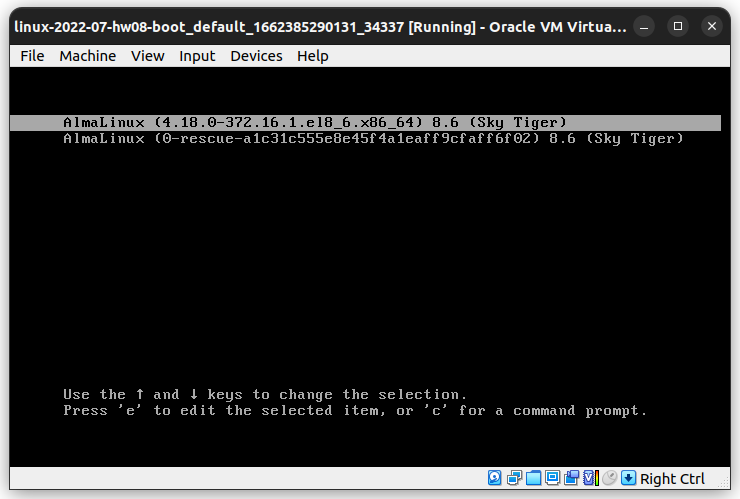
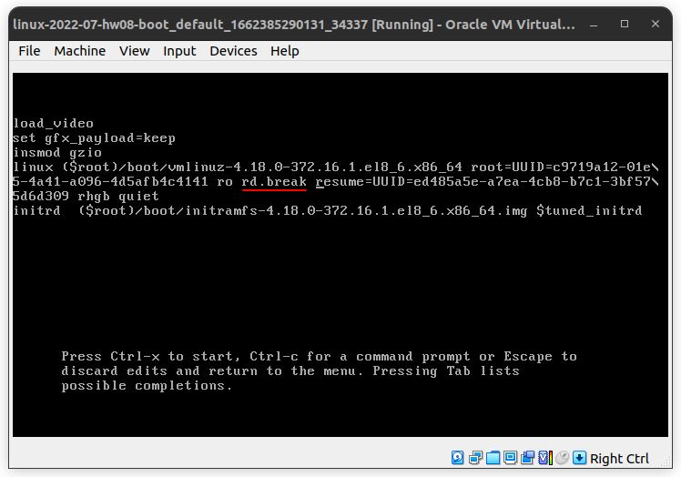
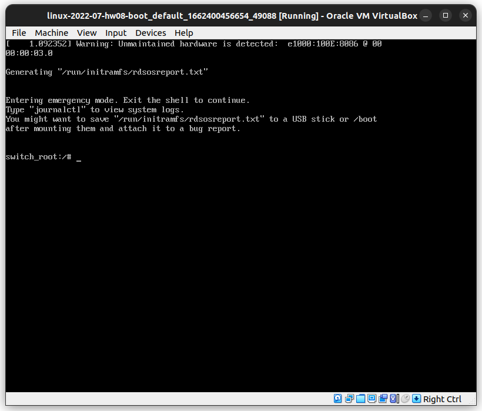
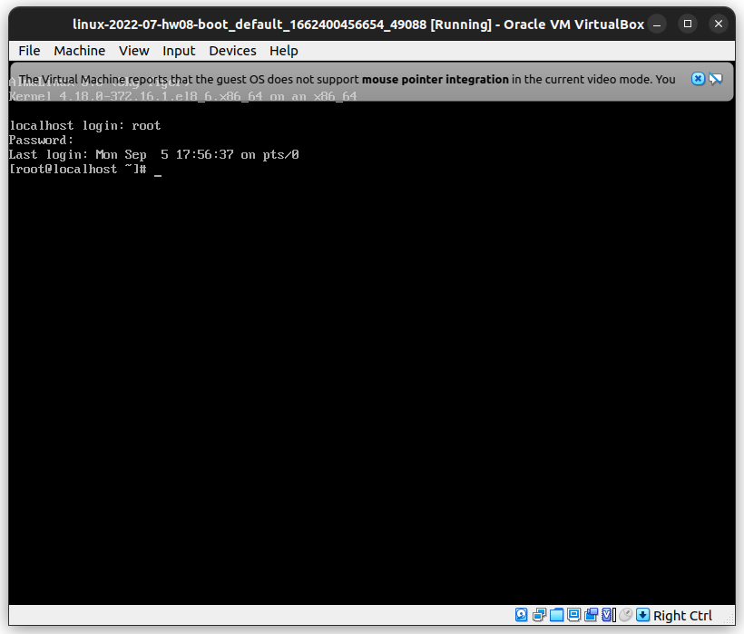
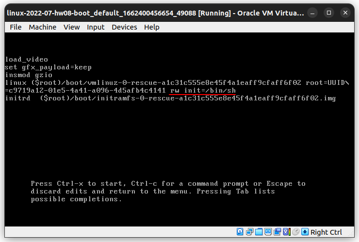
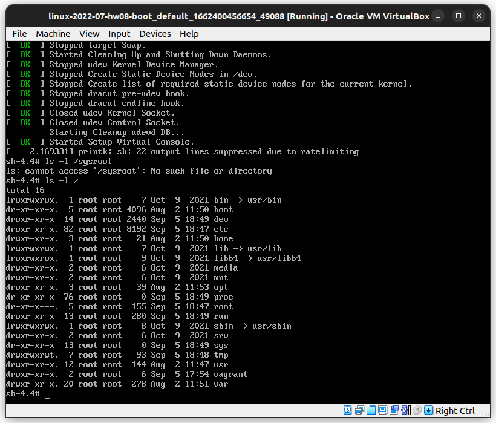
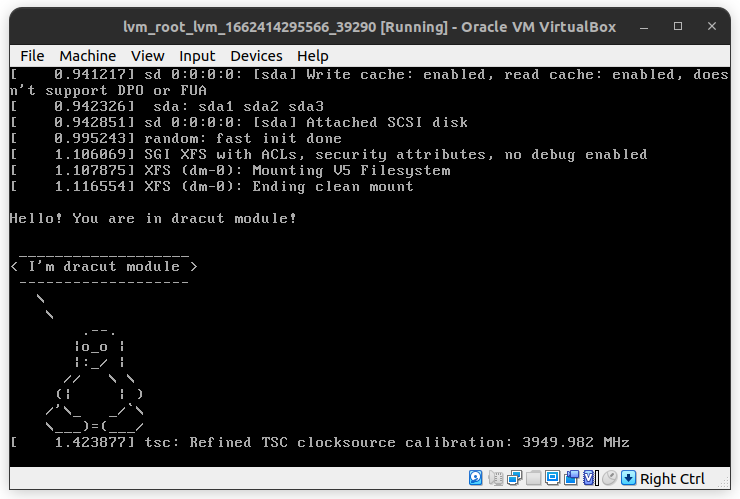

# Загрузка системы


## задание 

- Попасть в систему без пароля несколькими способами.
- Установить систему с LVM, после чего переименовать VG.
- Добавить модуль в initrd.
- (*) Сконфигурировать систему без отдельного раздела с /boot, а только с LVM
    Репозиторий с пропатченым grub: https://yum.rumyantsev.com/centos/7/x86_64/
    PV необходимо инициализировать с параметром --bootloaderareasize 1m

### полезные ссылки

- [sudoers](https://www.digitalocean.com/community/tutorials/how-to-edit-the-sudoers-file-ru)
- [vi](https://neoserver.ru/help/osnovnie-komandi-redaktora-vi-vim)
- https://github.com/thedolphin/dracut-root-lv-resize

## Попасть в систему без пароля несколькими способами.

Для начала отменим для пользователя vagrant использование `sudo` без пароля.

Просто удалим файл где пользователю vagrant дают право запускать sudo без пароля (NOPASSWD). 
```shell
rm -f /etc/sudoers.d/vagrant
reboot
```

Пытаемся сделать `sudo su`. Требует пароль 
```
$ sudo su

We trust you have received the usual lecture from the local System
Administrator. It usually boils down to these three things:

    #1) Respect the privacy of others.
    #2) Think before you type.
    #3) With great power comes great responsibility.

[sudo] password for vagrant: 
```
Мы создали ситуацию когда потерян пароль от пользователя vagrant. Пароля от root мы и не знали 🤷

Забавно, что теперь не работают команды `vagrant reload` и `vagrant halt`. 😅
Так что перезагружаем ВМ через GUI Virtualbox


## Способ 1. Восстановление с помощь `rd.break`

Чтобыбы сделать этот трюк, нужно в Vagrantfile включить gui режим. 

Во время загрузки системы появится меню grub, нам нужно надажь клавишу `e`.



Появится конфиг Grub. В нём добавляем опцию загрузки ядра linux `rd.break`.  


Жмем `ctrl+x`

Система загрузилась в initramfs


С помощью команды `mount | grep sysroot` видим что файловая система смотрирована в режиме read-only.
Нужно её перемонтировать в режиме rw.

```shell
mount -o remount,rw /sysroot
chroot /sysroot
passwd root
touch /.autorelabel
exit
exit
```
Пароль от root теперь `asdf`.
После выхода из initramfs SeLenux долго что-то думал и в итоге перезагрузил ВМ.

После перезагрузки у меня получилось зайти от имени пользователя с паролем `asdf`.



## Способ 2. Попасть в систему с помощью init=/bin/sh

Вместо rd.break как в прошлом примере, удаляем все опции кроме ro и добавим при загрузке ядра опцию `init=/bin/sh`



Мы в системе




### Способ 3. rw init=/sysroot/bin/sh

Как и в прошлом примере заменяем опции загрузки ядра на rw init=/sysroot/bin/sh.

Мы вошли в систему и можем делать что хотим.

Правда, не удаётся выполнить команду `passwd`


## Установить систему с LVM, после чего переименовать VG.


Создадим папку `lvm_root` и скопируем из [ДЗ по LVM](https://gitlab.com/gam6itko/linux-2022-07-hw-03-lvm) Vagrantfile.
```shell
vagrant up
vagrant ssh
```

Заходим в ВМ и смотрим на конфигурацию дисков.
```
$ lsblk
NAME                    MAJ:MIN RM  SIZE RO TYPE MOUNTPOINT
sda                       8:0    0   40G  0 disk 
├─sda1                    8:1    0    1M  0 part 
├─sda2                    8:2    0    1G  0 part /boot
└─sda3                    8:3    0   39G  0 part 
  ├─VolGroup00-LogVol00 253:0    0 37.5G  0 lvm  /
  └─VolGroup00-LogVol01 253:1    0  1.5G  0 lvm  [SWAP]
```

Переименуем VG
```shell
vgrename VolGroup00 OtusRoot
```

```
# vgrename VolGroup00 OtusRoot
  Volume group "VolGroup00" successfully renamed to "OtusRoot"
```

Вносим правки в файлы /etc/fstab, /etc/default/grub, /boot/grub2/grub.cfg. 
Везде заменяем старое название `VolGroup00-LogVol00` на новое `OtusRoot-LogVol00`.

Пересоздаем initrd image, чтобы он знал новое название Volume Group
```shell
mkinitrd -f -v /boot/initramfs-$(uname -r).img $(uname -r)
```

Перезагружаемся. Заходим в ВМ и проверяем всё ли работает.
```
$ lsblk
NAME                  MAJ:MIN RM  SIZE RO TYPE MOUNTPOINT
sda                     8:0    0   40G  0 disk 
├─sda1                  8:1    0    1M  0 part 
├─sda2                  8:2    0    1G  0 part /boot
└─sda3                  8:3    0   39G  0 part 
  ├─OtusRoot-LogVol00 253:0    0 37.5G  0 lvm  /
  └─OtusRoot-LogVol01 253:1    0  1.5G  0 lvm  [SWAP]
```
Видим что всё удачно переименовалось


## Добавить модуль в initrd.

Будем делать пингвина

```shell
mkdir /usr/lib/dracut/modules.d/01test
cp /vagrant/dracut/* /usr/lib/dracut/modules.d/01test/
chmod a+x /usr/lib/dracut/modules.d/01test/module-setup.sh
chmod a+x /usr/lib/dracut/modules.d/01test/test.sh
mkinitrd -f -v /boot/initramfs-$(uname -r).img $(uname -r)
```

Проверяем какие модули загрузились
```shell
lsinitrd -m /boot/initramfs-$(uname -r).img | grep test
```
Наш модуль присутствует

Редактируем файл `/boot/grub2/grub.cfg` и убираем опции загрузки ядра rghb и quiet.
Перезагружаем компьютер.

После перезагрузки на 10 секунд появилась картинка с пингвином


