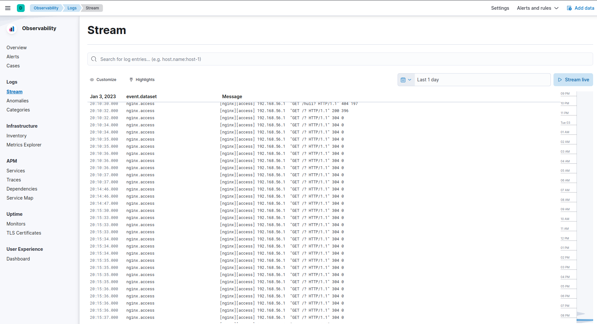
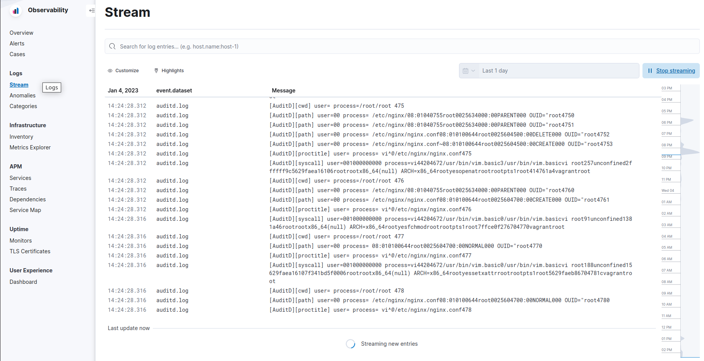

# Сбор и анализ логов 

## Задание

- в вагранте поднимаем 2 машины web и log
- на web поднимаем nginx
- на log настраиваем центральный лог сервер на любой системе на выбор
  - journald;
  - rsyslog;
  - elk.
- настраиваем аудит, следящий за изменением конфигов nginx

Все критичные логи с web должны собираться и локально и удаленно.
Все логи с nginx должны уходить на удаленный сервер (локально только критичные).
Логи аудита должны также уходить на удаленную систему.
Формат сдачи ДЗ - vagrant + ansible

Задания со звёздочкой:
- развернуть еще машину elk таким образом настроить 2 центральных лог системы elk и какую либо еще. 
    В elk должны уходить только логи нжинкса, во вторую систему все остальное.


## Полезные ссылки

- https://habr.com/ru/post/538840/
- https://www.elastic.co/guide/en/elasticsearch/reference/8.5/docker.html
- https://www.elastic.co/guide/en/elasticsearch/reference/8.5/cat.html
- https://www.elastic.co/guide/en/beats/filebeat/8.5/filebeat-module-nginx.html
- https://www.elastic.co/guide/en/beats/filebeat/current/filebeat-installation-configuration.html
- https://xakep.ru/2011/03/30/54897/
- https://habr.com/ru/company/selectel/blog/267833/
- [Таблица номеров syscall](https://filippo.io/linux-syscall-table/)


## Выполнение

С помощью ansible мы устанавливаем следующие пакеты:

- web
  - auditd
  - nginx
- log
  - docker

Они установятся с помощью команды `vagrant up` либо `vagrant provision`

### ELK

Установить ELK будет не просто, т.к. на территории РФ после 24.02.2022 эти репозитории недоступны. Но доступен докер. Будем работать с ним.
На машине log должно быть минимум 4GB ОЗУ чтобы всё работало без тормозов. Так советуют на сайте ES.

Чтобы заково не скачивать после удаления ВМ с сети (~3GB) образы docker. Применим хак: скачаем образы на host-machine и далее будет их копировать на guest-machine.
На хосте запускаем команду `./docker-warmup.sh`.

На guest запускаем команды
```shell
docker import /vagrant/docker-image/elasticsearch.image
docker import /vagrant/docker-image/kibana.image
```

logstash мы использовать не будетм, т.к. будем использовать filebeat

#### es

Послу успешного запуска docker-compose пытаемся проверить работает ли ES.

Делаем запрос из host-machine
```shell
$ curl -X GET "192.168.56.24:9200/_cat/master?help&pretty"
{
  "error" : {
    "root_cause" : [
      {
        "type" : "security_exception",
        "reason" : "missing authentication credentials for REST request [/_cat/master?help&pretty]",
        "header" : {
          "WWW-Authenticate" : [
            "Basic realm=\"security\" charset=\"UTF-8\"",
            "ApiKey"
          ]
        }
      }
    ],
    "type" : "security_exception",
    "reason" : "missing authentication credentials for REST request [/_cat/master?help&pretty]",
    "header" : {
      "WWW-Authenticate" : [
        "Basic realm=\"security\" charset=\"UTF-8\"",
        "ApiKey"
      ]
    }
  },
  "status" : 401
}
```
Похоже что-то работает не гладко. И нам нужно отключить аутентификаци. Делаем это путём добавление env `xpack.security.enabled=false` в docker.


Делаем тот же запрос еще раз
```shell
$ curl -X GET "localhost:9200/_cat/master?v=true&pretty"
id                     host       ip         node
Gx4Z61Q8SleZYj_mD6Az6A 172.18.0.3 172.18.0.3 es-node
```

Так же можно просто зайти через web-браузер на адрес http://192.168.56.24:9200/ и уведеть ответ от es-server
```json
{
  "name" : "es-node",
  "cluster_name" : "es-docker-cluster",
  "cluster_uuid" : "mP9w2cycSIipYv0iM3Jv-w",
  "version" : {
    "number" : "8.5.3",
    "build_flavor" : "default",
    "build_type" : "docker",
    "build_hash" : "4ed5ee9afac63de92ec98f404ccbed7d3ba9584e",
    "build_date" : "2022-12-05T18:22:22.226119656Z",
    "build_snapshot" : false,
    "lucene_version" : "9.4.2",
    "minimum_wire_compatibility_version" : "7.17.0",
    "minimum_index_compatibility_version" : "7.0.0"
  },
  "tagline" : "You Know, for Search"
}
```


#### kibana

Web ui кибаны распологается по адресу http://192.168.56.24:5601/

В этом web ui прописываем адресс сервера http://192.168.56.24:9200 и вводим код, который отображается в логах kibana (у меня он был  504 156).

В kibana вошли, осталось отобразить в ней данные.


### Nginx filebeat для отправски логов в ELK

Стартовая страница nginx доступна по адресу http://192.168.56.23:80/

С помощью команд `cat /var/log/nginx/access.log` и `cat /var/log/nginx/error.log` мы можем простатривать логи которые генерирует nginx

Нам нужно установить filebeat.

Т.к. из РФ нельзя скачать напрямую эти файлы, то я попросил одного моего друга из другой страны скачать файл по ссылке 
https://artifacts.elastic.co/downloads/beats/filebeat/filebeat-8.5.3-amd64.deb, который я положил в папку dl.

Внутри ВМ web устанавливаем пакет с помощью команды `sudo dpkg -i /vagrant/dl/filebeat-8.5.3-amd64.deb`.

Конфигурационный файл находится в `/etc/filebeat.yml`. Нам нужно настроить отправку логов в elasticsearch.

Включаем модуль nginx
```shell
filebeat modules enable nginx
systemctl start filebeat
```

В файле `/etc/filebeat/modules.d/nginx.yml` включаем все логи и перезапускаем filebeat.service.

Если у нас всё получилилось, то идём на страницу http://192.168.56.24:5601/app/logs/stream и смотрим есть ли там обновление логов.
Чтобы они обновлялись нужно переодически перезагружать страницу http://192.168.56.23:80/



#### auditd

Чтобы собирать логи auditd нужно просто включить модуль `filebeat modules enable auditd` и в файле `/etc/filebeat/modules.d/auditd.yml` включить модуль.

Осталось настроить auditd чтобы он собирал логировал изменения конфига nginx.
Создадим файл `/etc/audit/rules.d/my.rules` со следующими правилами
```
-w /etc/audit/auditd.conf -p wa
-w /etc/audit/audit.rules -p wa

-w /etc/nginx/nginx.conf -p wa
-w /etc/nginx/conf.d/ -p wa
-w /etc/nginx/sites-enabled/ -p wa
```

Перезагрузим службу `systemctl restart auditd`. 
После этого в файле `/etc/audit/audit.rules` должны появиться наши правила из файла my.rules

Добавим в файл `/etc/nginx/nginx.conf` строку `charset utf-8;` в раздел http и сохраним в изменения.

Если после этого выполнить команду `aureport -s` то мы видим что появились новые 4 строчки.
```
1489. 01/04/23 11:12:18 82 4533 vi 1000 462
1490. 01/04/23 11:12:18 257 4533 vi 1000 463
1491. 01/04/23 11:12:18 91 4533 vi 1000 464
1492. 01/04/23 11:12:18 188 4533 vi 1000 465
```
Номера событий отображены в последней колонке (462...465). 
Детальную информацию по ним можно получить командой `ausearch -a 462` (правда, понятнее не станет что произошло)

Так же новые записи видны и в файле /var/log/audit/audit.log.

#### auditd to ELK

Все перечисленное выше говорит о том что события аудита всё же фиксируются и нам нужно отправить их в ES.

Проверяем файл настроек /etc/filebeat/modules.d/auditd.yml отправка событий об аудите должна быть включена.
```yaml
- module: auditd
  log:
    enabled: true
```
Меняем конфиг и перезагружаем систему filebeat.

Заходим в kibana и видим что ES принимает логи аудита от filebeat 🥳




