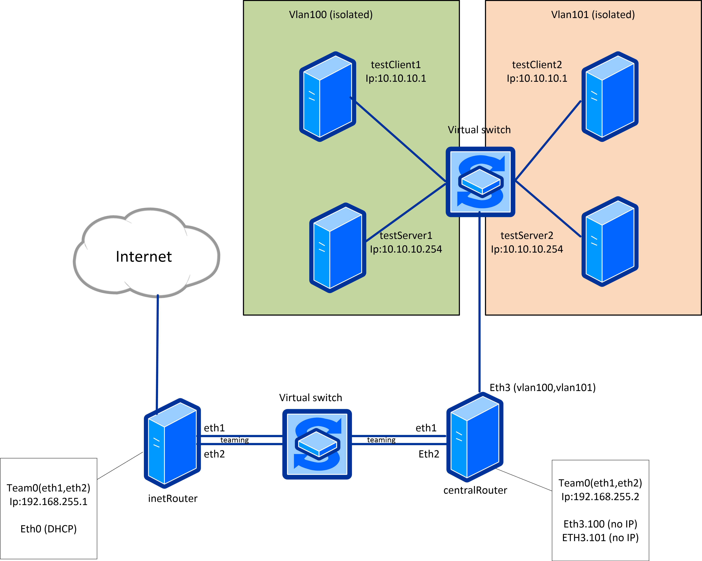

## Vlan, bonding

## Задание



В Office1 в тестовой подсети появляется сервер с доп. интерфесами и адресами в internal сети testLAN:
- testClient1 - 10.10.10.254
- testClient2 - 10.10.10.254
- testServer1- 10.10.10.1
- testServer2- 10.10.10.1

Изолировать с помощью vlan:
testClient1 <-> testServer1
testClient2 <-> testServer2

Между centralRouter и inetRouter создать 2 линка (общая inernal сеть) и объединить их с помощью bond-интерфейса,
проверить работу c отключением сетевых интерфейсов


## Полезные материалы

- http://www.adminia.ru/linux-bonding-obiedinenie-setevyih-interfeysov-v-linux/
- https://github.com/dbelkovsky/otus-linux/tree/master/net_vlan

## Выполнение

Vlan будем настраивать с помощью конфигов `network-scripts`.

В схему добавлены 2 дополнительных роутера:
- testRouter1: testClient1, testServer1
- testRouter2: testClient2, testServer2

Нужно будет добавить для testClient1, testClient2, testRouter1, testRouter2, testServer1, testServer2
файлы типа `/etc/sysconfig/network-scripts/ifcfg-vlan000` с настройками vlan.

После поднятия машин сделаем несколько проверок.

С машин test(Client|Server)(1|2) пакеты в интернет уходят.

### Проверим изолированность ip

testClient1
```
$ ip a
3: eth1: <BROADCAST,MULTICAST,UP,LOWER_UP> mtu 1500 qdisc pfifo_fast state UP group default qlen 1000
    link/ether 08:00:27:ca:8d:49 brd ff:ff:ff:ff:ff:ff
    inet6 fe80::bf70:5b1c:6c22:58e2/64 scope link noprefixroute 
       valid_lft forever preferred_lft forever
4: eth1.100@eth1: <BROADCAST,MULTICAST,UP,LOWER_UP> mtu 1500 qdisc noqueue state UP group default qlen 1000
    link/ether 08:00:27:ca:8d:49 brd ff:ff:ff:ff:ff:ff
    inet 10.10.10.2/24 brd 10.10.10.255 scope global noprefixroute eth1.100
       valid_lft forever preferred_lft forever
    inet6 fe80::a00:27ff:feca:8d49/64 scope link 
       valid_lft forever preferred_lft forever
```

testServer1
```
$ ip a
3: eth1: <BROADCAST,MULTICAST,UP,LOWER_UP> mtu 1500 qdisc pfifo_fast state UP group default qlen 1000
    link/ether 08:00:27:00:09:86 brd ff:ff:ff:ff:ff:ff
    inet6 fe80::3bf0:51d3:6c60:6f5c/64 scope link noprefixroute 
       valid_lft forever preferred_lft forever
4: eth1.100@eth1: <BROADCAST,MULTICAST,UP,LOWER_UP> mtu 1500 qdisc noqueue state UP group default qlen 1000
    link/ether 08:00:27:00:09:86 brd ff:ff:ff:ff:ff:ff
    inet 10.10.10.1/24 brd 10.10.10.255 scope global noprefixroute eth1.100
       valid_lft forever preferred_lft forever
    inet6 fe80::a00:27ff:fe00:986/64 scope link 
       valid_lft forever preferred_lft forever
```

На testClient1 запустим команду `ping 10.10.10.1` а на testServer1 `tcpdump -e -i eth1.100`

testServer1
```
$ tcpdump -e -i eth1.100
tcpdump: verbose output suppressed, use -v or -vv for full protocol decode
listening on eth1.100, link-type EN10MB (Ethernet), capture size 262144 bytes
16:26:41.389096 08:00:27:ca:8d:49 (oui Unknown) > 08:00:27:00:09:86 (oui Unknown), ethertype IPv4 (0x0800), length 98: 10.10.10.2 > testServer1: ICMP echo request, id 1199, seq 1, length 64
16:26:41.389123 08:00:27:00:09:86 (oui Unknown) > 08:00:27:ca:8d:49 (oui Unknown), ethertype IPv4 (0x0800), length 98: testServer1 > 10.10.10.2: ICMP echo reply, id 1199, seq 1, length 64
16:26:46.401387 08:00:27:00:09:86 (oui Unknown) > 08:00:27:ca:8d:49 (oui Unknown), ethertype ARP (0x0806), length 42: Request who-has 10.10.10.2 tell testServer1, length 28
16:26:46.401598 08:00:27:ca:8d:49 (oui Unknown) > 08:00:27:00:09:86 (oui Unknown), ethertype ARP (0x0806), length 60: Reply 10.10.10.2 is-at 08:00:27:ca:8d:49 (oui Unknown), length 46
```

Видим что в трейсинге фигурируют MAС-адреса `08:00:27:00:09:86` и `08:00:27:ca:8d:49`, которые пренадлежат testClient1.


### Bonding

bond из двух интерфейсов на машине `centralRouter` и `inetRouter`, параметры, которые использованы в конфигурационном файле интерфейса bond0:

- `mode=1` - определяет политику поведения объединенных интерфейсов. 1 - это политика активный-резервный.
- `miimon=100` - Устанавливает периодичность MII мониторинга в миллисекундах. Фактически монитринг будет осуществляться 10 раз в секунду (1с = 1000 мс).
- `fail_over_mac=1` - Определяет как будут прописываться MAC адреса на объединенных интерфейсах в режиме active-backup при переключении интерфесов.

Интерфейсы имеют разные MAC адреса. Bond интерфейс использует MAC адрес того интерфейса, который в данный момент Active.

Чтобы проверить нужно зайти на `centralRouter` или `inetRouter` и выполнить `cat /proc/net/bonding/bond0`
