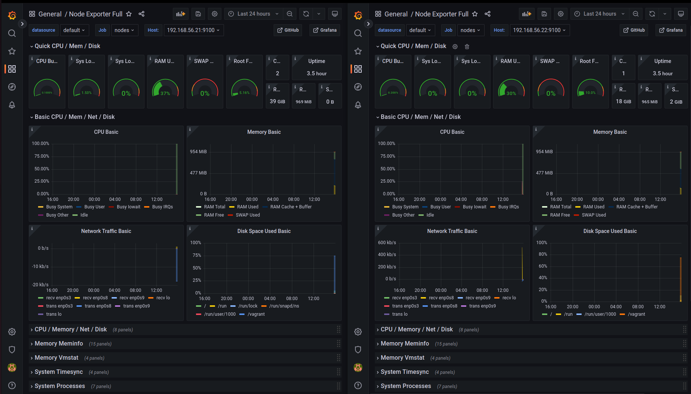
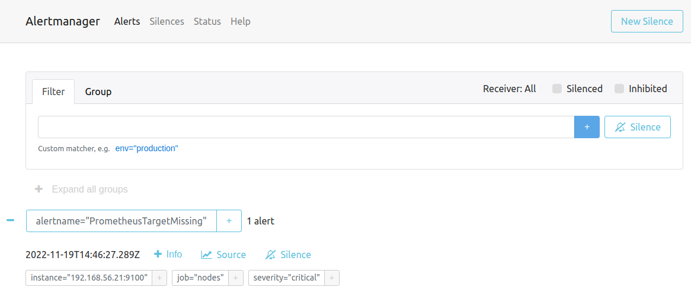
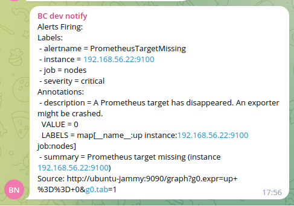

# Monitoring

## Задание

- Настроить дашборд с 4-мя графиками
  - память;
  - процессор;
  - диск;
  - сеть.
- Настроить на одной из систем:
  - zabbix (использовать screen (комплексный экран);
  - prometheus - grafana.
  - использование систем, примеры которых не рассматривались на занятии.


## Полезные ссылки

- https://developer.hashicorp.com/vagrant/docs/networking/private_network
- https://serverspace.io/support/help/install-prometheus-ubuntu-20-04
- https://losst.pro/nastrojka-alertmanager-prometheus
- https://www.digitalocean.com/community/tutorials/how-to-use-ansible-to-install-and-set-up-docker-on-ubuntu-18-04


## Информация для проверяющего

Чтобы всё работало нужно создать файл. В который нужно поместить явки и пароли от telegram бота
./playbooks/prometheus/group_vars/all.yaml

```yaml
---
telegram_bot_token: "your_api_token"
telegram_chat_id: chat_id
```

## Выполнение

Будут выполнены следующие шаги:
- на машину main установим prometheus, grafana, alert-manager
- на node1 и node2 установим node_exporter, который будет собирать метрики машины для prometheus
- настроим несколько правил для alert-manager, если случится событие то будет отправлено сообщение в telegram-чат.
  - машина упала. Будем вырубать node_exporter или выключать машину
  - количество свободного RAM слишком мало. С помощью скрипта будет иммитаровать расточительный расход памяти

Чтобы облегчить себе работу будем устанавливать окружение с помощью ansible скриптов.


### prometheus, grafana install

Оказалось что в grafana забанила пользователей из РФ. Так что скачать свежи установочные пакеты с официального репозитория нельзя.
НО! Можно скачать docker image со всежей grafana. Так что будем использовать prometheus и grafana в docker образах

prometheus web ui: http://192.168.56.20:9090
grafana web ui: http://192.168.56.20:3000

На странице http://192.168.56.20:3000/datasources добавим вручную [prometheus](http://192.168.56.20:9090) datasource.

Добавим вручную [node_exporter dashboard](https://grafana.com/grafana/dashboards/1860-node-exporter-full/) в grafana 
чтобы наблюдать за состоянием наших машин node1 и node2. 

Для этого скопируем ID с сайта и вставим на этой странице http://192.168.56.20:3000/dashboard/import.
Нужно будет установить prometheus datasource сделанный ранее.



Судя по метрикам можно сделать предварительный вывод, что almalinux (node2)  меньше потребляет ресурсов чем ubuntu (node1).

### alertmanager

alertmanager web ui: http://192.168.56.20:9093

В создании правил помог сайт <https://awesome-prometheus-alerts.grep.to/rules.html>]


## Проверка

### node down

Отключим `node1`. В telegram-чат должно придти сообщение.
```shell
vagrant halt node1
```

В alertmanager появилося alert.


Сообщение в телеграм не пришло. Глянем логи alertmanager
```
ts=2022-11-19T14:46:57.485Z caller=notify.go:732 level=warn component=dispatcher receiver=telegram integration=telegram[0] msg="Notify attempt failed, will retry later" attempts=1 err="telegram: Bad Request: can't parse entities: Character '-' is reserved and must be escaped with the preceding '\\' (400)"
```

Оказалось что нужно в telegram_configs добавить настройку `render: HTML`.

После исправления конфига и перезагрузки alertmanager мне в telegram пришло сообщение.



