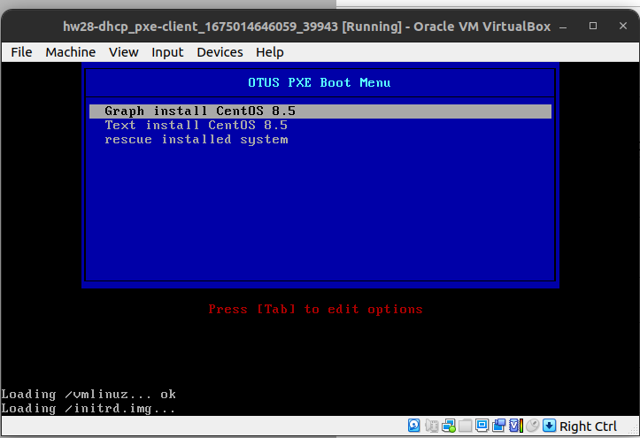
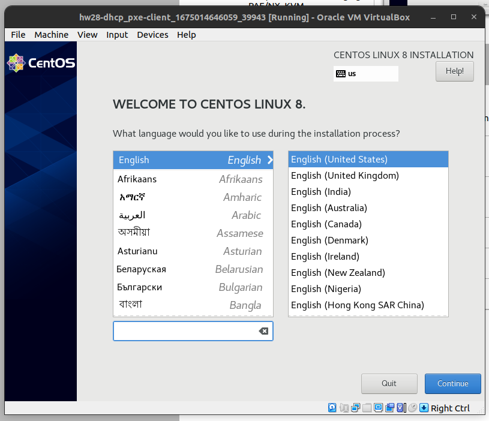
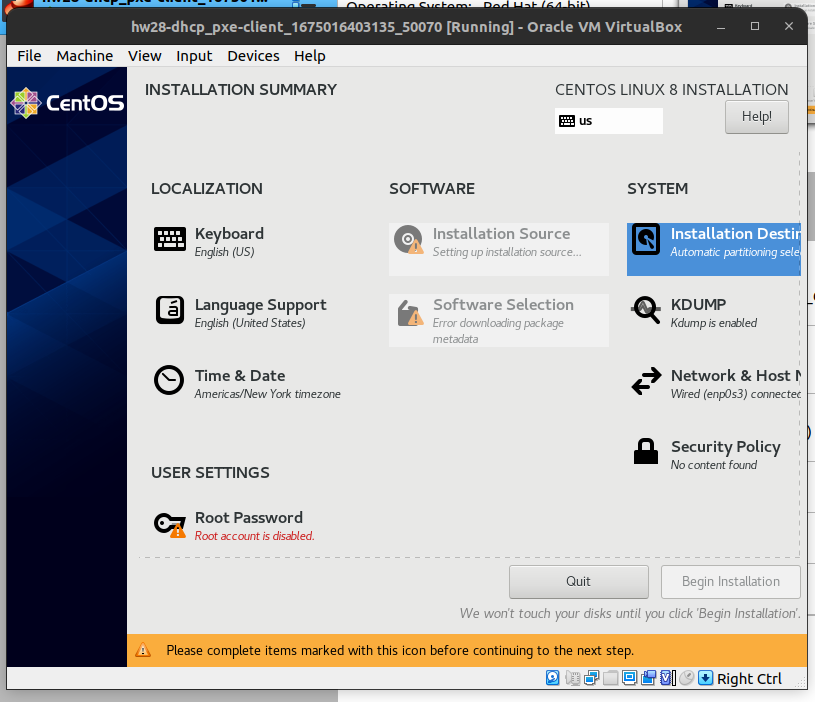
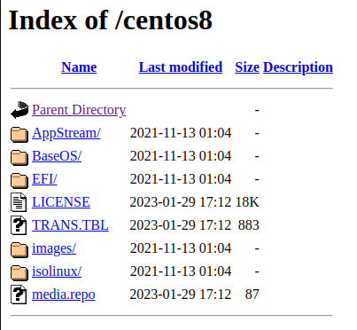
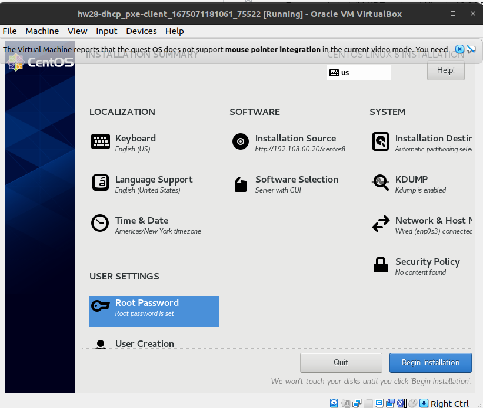
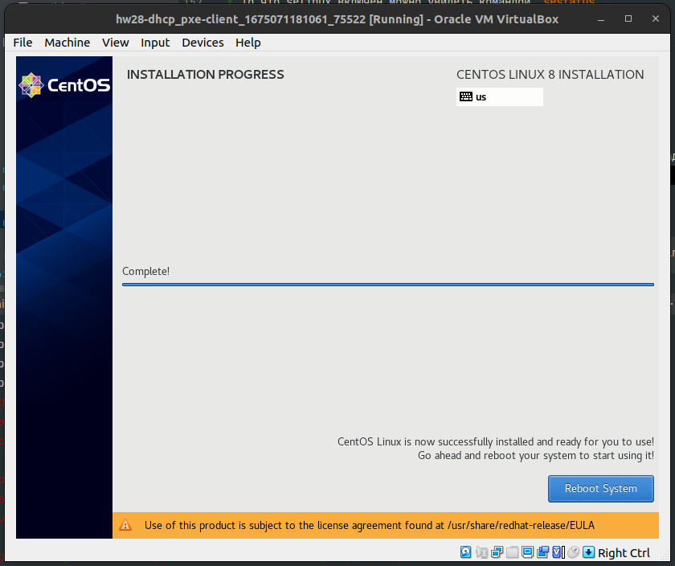
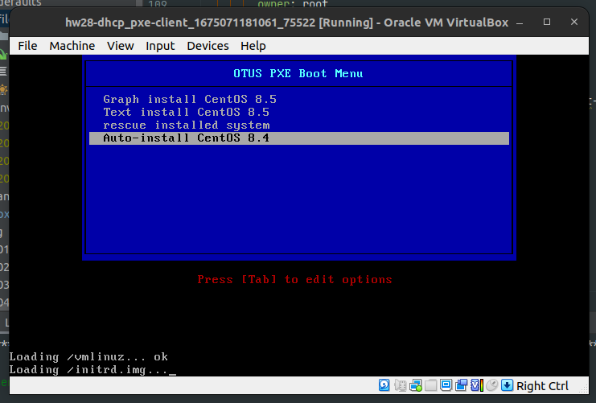

# DHCP

## Задание

### Настройка сервера установки дистрибутива

#### Зачем делать:
Для того чтобы повторить какие компоненты используются и самостоятельно пройти все этапы установки.

#### Задание:

Следуя шагам из документа установить и настроить загрузку по сети для дистрибутива CentOS8
https://docs.centos.org/en-US/8-docs/advanced-install/assembly_preparing-for-a-network-install либо репозиторием https://github.com/nixuser/virtlab/tree/main/centos_pxe
- настроить установку из репозитория HTTP
- настроить автоматическую установку для созданного kickstart файла (*)

#### Результат работы:
- ссылка на репозиторий github.
  - Vagrantfile с шагами установки необходимых компонентов
  - исходный код scripts для настройки сервера (если необходимо)
  - если какие-то шаги невозможно или сложно автоматизировать, то  инструкции по ручным шагам для настройки

### Настройка Cobbler (*)

#### Зачем делать:
Настройка сервера для автоматизации управления процессом сетевой установки. Поддержка установки различных дистрибутивов, разных версий. Автоматизация установки и шаблоны.

#### Задание:

- Следуя шагам из документа установить и настроить Cobbler https://cobbler.readthedocs.io/en/latest/quickstart-guide.html
- автоматизировать процесс установки
- Можно основываться на пример. Рекомендую обновить его до 8.x
  - https://github.com/michalkacprzyk/cobbler-kickstart-playground

#### Результат работы:
- ссылка на репозиторий github
  - Vagrantfile с шагами установки необходимых компонентов


## Полезные материалы

- https://developer.hashicorp.com/vagrant/docs/disks/usage
- https://stackoverflow.com/questions/49822594/vagrant-how-to-specify-the-disk-size
- https://access.redhat.com/documentation/en-us/red_hat_enterprise_linux/7/html/selinux_users_and_administrators_guide/sect-security-enhanced_linux-working_with_selinux-selinux_contexts_labeling_files

## Выполнение

Выполнялось по методичке.

### Качаем образ centos. Попытка 1

Образ centos/8 я скачал по ссылке http://mirrors.powernet.com.ru/centos/8.5.2111/isos/x86_64/CentOS-8.5.2111-x86_64-dvd1.iso.

Нельзя просто так взять и скачать большое файл в vagrant
Диск в машине по-умолчанию создаётся на 10GB. Можно его увеличить настройкой `server.vm.disk :disk, size: "20GB", primary: true`.
Но партиция sda1 не увеличится, нужно будет затрачивать дополнительные усилия чтобы это сделать.

В итоге я решил подключить еще один диск на 20Gb и скачать образ на него.
Но, возникла проблема при скачке образа.
```
TASK [Download ISO image CentOS 8.5] *******************************************
An exception occurred during task execution. To see the full traceback, use -vvv. The error was: socket.timeout: timed out
fatal: [pxe-server]: FAILED! => {"changed": false, "elapsed": 0, "msg": "failed to create temporary content file: timed out"}
```

Что это за ошибка еще такая "failed to create temporary content file: timed out" ?
Похоже ansible изначально какает файл в какую-то свою временную дирректорию и она на диске sda,а там нет места.

### Качаем образ centos. Попытка 2

[Данная статья](https://stackoverflow.com/questions/49822594/vagrant-how-to-specify-the-disk-size) помогла найти решение.

В Vagrant оставляем опцию `server.vm.disk :disk, size: "20GB", primary: true`. 
После поднятия машины lsblk говорит нам следующее:
```
```

- Нужно запустить команду `sudo cfdisk /dev/sda`
- Выбрать пункт меню Resize и нажать Enter. Новый размер будет 20G.
- Выбрать пункт меню Write.
- Ввести `yes` и нажать Enter.
- Выбрать пункт меню Quit.

Команда `resize2fs -p -F /dev/sda1` нам не поможет т.к. у sda1 файловая стстема xfs. Запустим команду `xfs_growfs /dev/sda1`

```
$ sudo xfs_growfs /dev/sda1
meta-data=/dev/sda1              isize=512    agcount=4, agsize=655296 blks
         =                       sectsz=512   attr=2, projid32bit=1
         =                       crc=1        finobt=1, sparse=1, rmapbt=0
         =                       reflink=1
data     =                       bsize=4096   blocks=2621184, imaxpct=25
         =                       sunit=0      swidth=0 blks
naming   =version 2              bsize=4096   ascii-ci=0, ftype=1
log      =internal log           bsize=4096   blocks=2560, version=2
         =                       sectsz=512   sunit=0 blks, lazy-count=1
realtime =none                   extsz=4096   blocks=0, rtextents=0
data blocks changed from 2621184 to 5242624

$ lsblk
NAME   MAJ:MIN RM SIZE RO TYPE MOUNTPOINT
sda      8:0    0  20G  0 disk 
`-sda1   8:1    0  20G  0 part /


$ df -h
Filesystem      Size  Used Avail Use% Mounted on
devtmpfs        467M     0  467M   0% /dev
tmpfs           485M     0  485M   0% /dev/shm
tmpfs           485M   13M  473M   3% /run
tmpfs           485M     0  485M   0% /sys/fs/cgroup
/dev/sda1        20G  3.4G   17G  17% /
tmpfs            97M     0   97M   0% /run/user/1000
```

Видим что /dev/sda1 имеет размер 20G.


### Настройка pxe-server

> **NOTE**
> Можно скачать в папку ~/Download iso-образ и раскомментировать строку в vagrantfile чтобы ansible постоянно заново не качал его.
> server.vm.provision "file", source: "~/Downloads/CentOS-8.5.2111-x86_64-dvd1.iso", destination: "/home/vagrant/CentOS-8.5.2111-x86_64-dvd1.iso"

Теперь запустим из **host**-machine ansible.

```shell
cd ansible/
ansible-playbook -i inventory/hosts.yaml pxe-server.yaml 
```

### Client

После настроек pxe-sercer. Желательно перезапустить `pxe-client`.

Заёдём в virtualbox и посмотрм что у нас в GUI.





Не известно по какой причине. Но я не вижу в ВМ мышь.

Стослкнулся с проблемой что нет места на диске. Решил в Vagrantfile ` client.vm.disk :disk, size: "30GB", primary: true`
Затем нужно при установке зайти в раздел `installation Destination` и нажать **Reload**.

Столкнулся с проблемой на на скриншоте.


#### Apache /iso troubleshooting

Если зайти на страницу http://localhost:8080/centos8/ то получаем ошибку "You don't have permission to access this resource".
В логах apache вижу следующее "AH01275: Can't open directory for index: /iso/".

Если зайти в логи `/var/log/audit/audit.log` то можно увидеть ошибку несоответсткия контекстов selinux
`scontext=system_u:system_r:httpd_t:s0 tcontext=unconfined_u:object_r:default_t:s0`.
То что selinux включен можно увидеть командой `sestatus`.

Возможные решения
- `setenforce 0`
- `chcon -u system_u /iso/`



После этих манипуляци при установке машина pxe-client сама найдёт адрес установки новой версии centos. 
Вводить рукаки ничего не нужно.

#### Gui installation

Устанавливаем root пароль и наконец-то можно пажать кнопку "Begin installation".





#### kikstart

Установка запускается с одной кнопки. 



