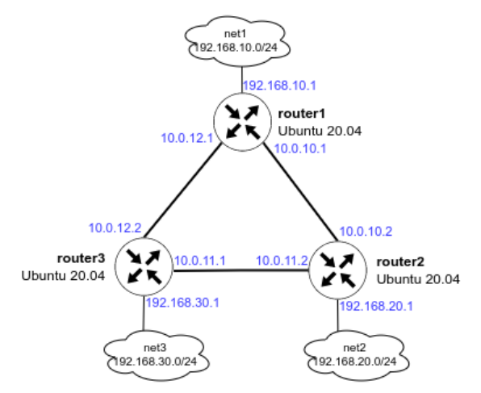
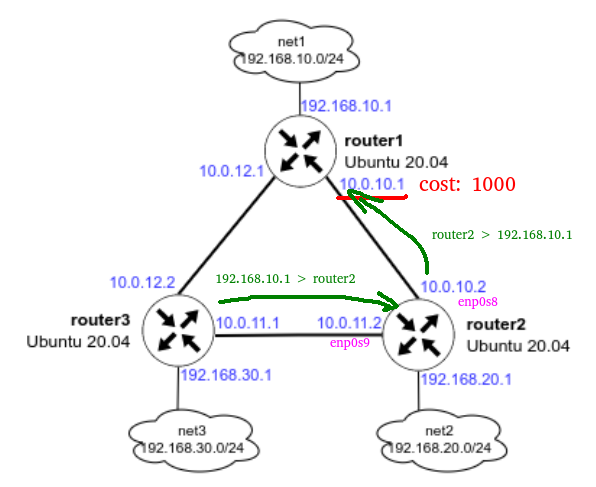

# Динамическая маршрутизация

OSPF -Open Shortest Path First 

## Задание

- Поднять три виртуалки
- Объединить их разными vlan
  - поднять OSPF между машинами на базе Quagga;
  - изобразить ассиметричный роутинг;
  - сделать один из линков "дорогим", но что бы при этом роутинг был симметричным.


## Подсказки



```shell
ansible router1 -m ansible.builtin.setup -i ansible/inventory/hosts.yaml
```

## Выполнение

Делал по методичке.

### Поднятие сети

Файлы настроек frr:
- ansible/files/router1/frr.conf
- ansible/files/router2/frr.conf
- ansible/files/router3/frr.conf

После поднятия машин видим на router1 такие маршруты
```
$ sudo vtysh

Hello, this is FRRouting (version 8.4.2).
Copyright 1996-2005 Kunihiro Ishiguro, et al.

router1# show ip route ospf

O   10.0.10.0/30 [110/100] is directly connected, enp0s8, weight 1, 00:10:10
O>* 10.0.11.0/30 [110/200] via 10.0.10.2, enp0s8, weight 1, 00:09:45
  *                        via 10.0.12.2, enp0s9, weight 1, 00:09:45
O   10.0.12.0/30 [110/100] is directly connected, enp0s9, weight 1, 00:09:53
O   192.168.10.0/24 [110/100] is directly connected, enp0s10, weight 1, 00:10:26
O>* 192.168.20.0/24 [110/200] via 10.0.10.2, enp0s8, weight 1, 00:10:01
O>* 192.168.30.0/24 [110/200] via 10.0.12.2, enp0s9, weight 1, 00:09:45
```

traceroute проходит 
```
$ traceroute 192.168.30.1
traceroute to 192.168.30.1 (192.168.30.1), 30 hops max, 60 byte packets
 1  192.168.30.1 (192.168.30.1)  0.220 ms  0.203 ms  0.194 ms
```

### Настройка ассиметричного роутинга

Запусм на router1 команду `ping -I 192.168.10.1 192.168.20.1`.

На router2 запустим `tcpdump -i enp0s8`. Видим что на этот interface приходят пакеты и через него же и отправляются.
```
18:09:06.652436 IP 192.168.10.1 > router2: ICMP echo request, id 1, seq 226, length 64
18:09:06.652462 IP router2 > 192.168.10.1: ICMP echo reply, id 1, seq 226, length 64
```

Так же изменёна "стоимость" интерфейса в конфиги.
```
# vtysh

router1# conf t
router1(config)# int enp0s8
router1(config-if)# ip ospf cost 1000
router1(config-if)# exit
router1(config)# exit
router1# show ip route ospf
```

Теперь путь до router2 такой.
```
# traceroute  192.168.20.1
traceroute to 192.168.20.1 (192.168.20.1), 30 hops max, 60 byte packets
1  10.0.12.2 (10.0.12.2)  0.258 ms  0.240 ms  0.231 ms
2  192.168.20.1 (192.168.20.1)  0.463 ms  0.423 ms  0.382 ms
```

Теперь если запустить на router1 команду `ping -I 192.168.10.1 192.168.20.1` то пинг проходит.

Если запустить на router2 `tcpdump -i enp0s9` то видим следующие пакеты.
```
17:29:08.599174 IP 192.168.10.1 > router2: ICMP echo request, id 7, seq 161, length 64
17:29:09.623228 IP 192.168.10.1 > router2: ICMP echo request, id 7, seq 162, length 64
```
Если запустить на router2 `tcpdump -i enp0s8` то видим следующие пакеты.
```
17:30:58.103332 IP router2 > 192.168.10.1: ICMP echo reply, id 8, seq 22, length 64
17:30:59.127407 IP router2 > 192.168.10.1: ICMP echo reply, id 8, seq 23, length 64
```
Видим что пакеты приходят на один interface а уходят с другого.

router1 `tcpdump -i enp0s8`
```
19:01:42.182715 IP 192.168.20.1 > router1: ICMP echo reply, id 1, seq 700, length 64
19:01:43.206783 IP 192.168.20.1 > router1: ICMP echo reply, id 1, seq 701, length 64
```
router1 `tcpdump -i enp0s9`
```
19:02:04.710425 IP router1 > 192.168.20.1: ICMP echo request, id 1, seq 722, length 64
19:02:05.734443 IP router1 > 192.168.20.1: ICMP echo request, id 1, seq 723, length 64
```

Пакеты теперь ходят так.


> Я не изменял настройку `net.ipv4.conf.all.rp_filter`. Даже если я её выставлю в 0, то пакеты продолжат ходить через разные интерфейсы. 
> Такое впечатление что она ни на что не влияет в ubuntu/jammy64.


### Настройка симметичного роутинга

На router2
```
# vtysh

router2# conf t
router2(config)# int enp0s8
router2(config-if)# ip ospf cost 1000
router2(config-if)# exit
router2(config)# exit
router2# exit
```

Если запустить на router2 `tcpdump -i enp0s8` то мы не увидим пакетов до route1.

Если запустить на router2 `tcpdump -i enp0s9` то мы не увидим пакетов до route1.
```
19:12:16.904021 IP 192.168.10.1 > router2: ICMP echo request, id 2, seq 185, length 64
19:12:16.904038 IP router2 > 192.168.10.1: ICMP echo reply, id 2, seq 185, length 64
```
